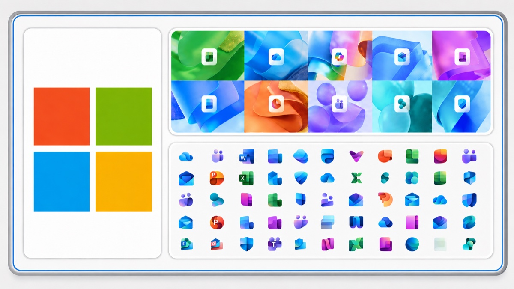

<h1 align="center">Hi, I'm Ibrahiim 👋</h1>

  UW Informatics student building thoughtful AI, data, and product experiences.

  

  <a href="https://ibrahiimmuhamud.vercel.app/">Portfolio</a> •
  <a href="mailto:ibrahiimmuhamud@gmail.com">Email</a>

  

  

  UW Information School student &nbsp;•&nbsp; Former Microsoft Discovery Intern

## About Me

- 🎓 Studying Informatics at the University of Washington
- 💼 Former Microsoft Discovery Intern
- 🤖 Built an internal AI product for the executive communications team supporting Microsoft's Chief Customer Officer
- 🔍 Interested in product management, responsible AI, data, and user-centered technology
- 🚀 Currently building tools that turn raw information into useful product insights

## Featured Work

### 🎮 [Roblox Experience Tracker](https://github.com/ibrahiimmuhamud/roblox-experience-tracker)

A Python and SQLite analytics tool that tracks how Roblox experiences gain or lose players over time.

- Collects player statistics through Roblox's public API
- Measures momentum across historical snapshots
- Handles retries, duplicate writes, and malformed records
- Includes 13 offline tests and automated GitHub Actions collection

### 🌐 [Personal Portfolio](https://ibrahiimmuhamud.vercel.app/)

A personal website showcasing my experience, projects, and interest in building technology around real user needs.

[Visit the website](https://ibrahiimmuhamud.vercel.app/) · [View the source](https://github.com/ibrahiimmuhamud/portfolio-website)

## Tools and Technologies

### AI & Developer Tools

  
  
  
  
  
  
  
  
  
  
  

### Languages, Data & Product

  
  
  
  
  
  
  
  

## What I Care About

I am most interested in the intersection of technology and human needs: understanding a problem, listening to users, and turning those insights into products that make someone's day easier.

## Let's Connect

  I'm always interested in meeting students, builders, and product-minded people working on meaningful technology.

  
  
  

  Let's build thoughtful technology around real human needs.

